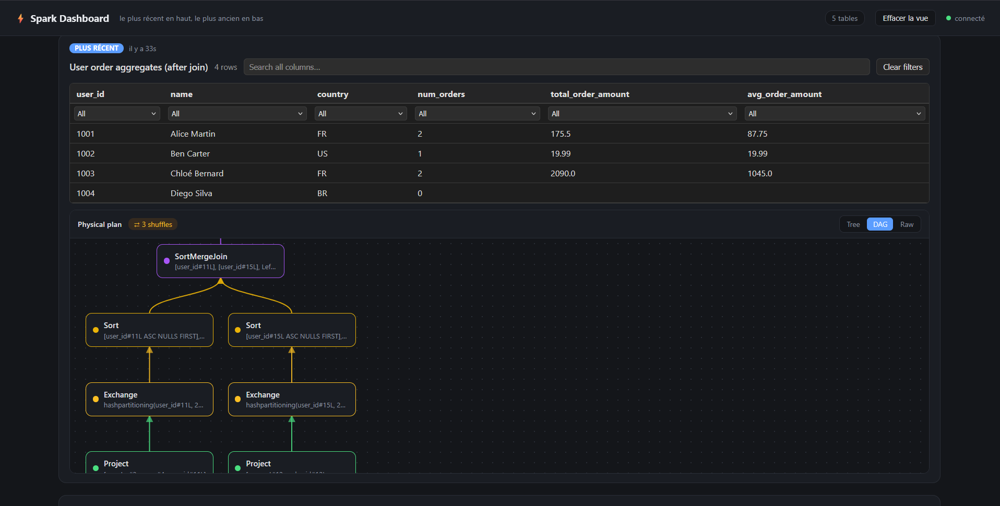
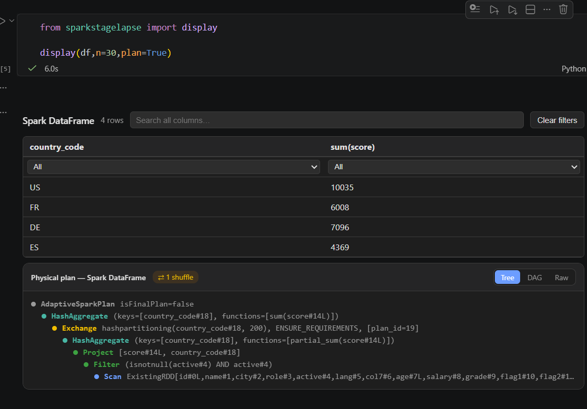

# sparkstagelapse

Interactive Spark DataFrame display with a persistent local dashboard.
Use `display()` in notebooks, scripts, or Databricks jobs and keep the web
view open after the caller exits.

## Installation

From the repository root:

```bash
pip install -e .
```

Optional Textual explorer support:

```bash
pip install -e ".[tui]"
```

## Usage

```python
from sparkstagelapse import display

# Spark DataFrame in a script or notebook
display(df, title="Employees")

# Explicit modes
display(df, title="Employees", mode="web")   # persistent local dashboard
display(df, title="Employees", mode="tui")   # full-screen Textual explorer
display(df, title="Employees", mode="rich")  # terminal-friendly ASCII table
```

### `display()` behavior

- `mode="auto"` (default): renders inline in notebooks, otherwise uses the
  persistent web dashboard.
- `mode="web"`: always push to the local dashboard.
- `mode="tui"`: opens the Textual full-screen explorer (blocking).
- `mode="rich"`: prints a rich ASCII table in the terminal.
- `mode="notebook"`: returns a display object for notebook rendering.

`display()` is notebook-aware: in notebook context it uses HTML-rich output,
and in scripts it falls back to the dashboard or terminal rendering.

### Notebook and script support

- In notebooks, `display(df)` renders rich HTML output directly in the cell
  output area.
- In plain Python scripts, `display(df)` pushes the result to the local
  dashboard and continues without blocking.

This means you can use the same API in both environments and still get a
rich, persistent view of tables and query plans.

### Persistent view after runtime

Unlike Spark UI, this local dashboard keeps your table snapshots and captured
plans available after the calling code finishes. Because the dashboard runs in
its own detached process, you can revisit the same browser view later and see
previously pushed tables and plans even after your script has exited.

### Query plans

Use `plan=True` to capture a Spark explain plan and show it alongside the
result table.

```python
display(df, title="Employees", plan=True, plan_mode="simple")
```

## Screenshots





> The dashboard preserves tables and plans after your script ends, unlike
> Spark UI, which only shows the current cluster session state.

## Persistent local dashboard

The dashboard is hosted by a detached local process on `127.0.0.1:8765`
by default.

When a dashboard push occurs:

1. The client checks `/health` on the configured host/port.
2. If an existing server is available, it reuses it.
3. If not, it spawns a detached dashboard server process and waits for it
   to become ready.

Because the dashboard runs in a separate process, it stays alive after your
script exits and can be reused by later runs on the same host/port.

### Manual server control

```bash
python -m sparkstagelapse.dashboard status
python -m sparkstagelapse.dashboard stop
python -m sparkstagelapse.dashboard start
```

Logs and pid files are stored in:

- `~/.cache/sparkstagelapse/dashboard_<port>.log`
- `~/.cache/sparkstagelapse/dashboard_<port>.pid`

### Custom host/port

```python
from sparkstagelapse import display, DashboardClient

client = DashboardClient(host="127.0.0.1", port=9000)
display(df, title="Preview", _dashboard=client)
```

## Public API

```python
from sparkstagelapse import display, DashboardClient
```

- `display(df, title="...", mode="auto", n=200, truncate=True, plan=False, plan_mode="simple", _dashboard=None)`
- `DashboardClient` for custom host/port or manual dashboard reuse

`SparkDisplay` remains available as a lower-level helper for advanced pandas rendering, but `display()` is the recommended public interface.

## Package structure

```
sparkstagelapse/
├── __init__.py
├── display.py
├── dashboard/
│   ├── __init__.py
│   ├── __main__.py
│   ├── app.py
│   ├── client.py
│   ├── models.py
│   ├── server.py
│   ├── state.py
│   ├── rendering/
│   │   ├── __init__.py
│   │   ├── plan_html.py
│   │   ├── plot_spec.py
│   │   └── table_html.py
│   └── routers/
│       ├── __init__.py
│       ├── pages.py
│       ├── tables.py
│       └── ws.py
```

## Development

```bash
pip install -e ".[dev,tui]"
ruff check .
pytest -v
python -m build
twine check dist/*
```

## Notes

- The dashboard server is started as a separate OS process, not a daemon
  thread, so it survives the caller process.
- `display()` converts Spark DataFrames to pandas for rendering and limits
  results to `n=200` rows by default.
- The `tui` mode requires `textual`.
